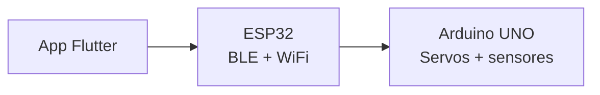

<!--
  README personal para perfil de GitHub
  Este archivo NO se sube al repo del proyecto (.gitignore).

  Uso:
  1. Crear repo: github.com/TU_USUARIO/TU_USUARIO
  2. Copiar el contenido (sin este comentario) a README.md de ese repo
-->

# José Luis Turpo Quispe

Desarrollador **web fullstack** y de **aplicaciones multiplataforma** (Flutter y Android nativo con Kotlin). En paralelo estoy aprendiendo **IoT** y **prototipado con ESP32**, conectando firmware embebido con interfaces móviles y servicios web.

---

## Perfil

| Área | Enfoque |
|------|---------|
| Principal | Desarrollo web fullstack |
| Mobile | Apps multiplataforma con Flutter; Android nativo con Kotlin |
| En aprendizaje | IoT, prototipado con ESP32, integración hardware–software |

Trabajo con proyectos que van desde APIs y frontends web hasta apps móviles en producción. Recientemente amplío el stack hacia dispositivos físicos: sensores, actuadores, BLE/WiFi y comunicación serial entre microcontroladores.

---

## Stack

| Categoría | Tecnologías |
|-----------|-------------|
| Web | HTML, CSS, JavaScript/TypeScript, frameworks fullstack según proyecto |
| Mobile | Flutter, Dart, Kotlin, Android SDK |
| IoT (aprendizaje) | ESP32, Arduino, BLE, WiFi, UART, sensores y actuadores |
| Herramientas | Git, GitHub, Android Studio, Arduino IDE |

---

## Proyecto en curso — Inodoro Smart

Prototipo IoT de aprendizaje: sistema de control para inodoro inteligente con tres capas.

| Capa | Tecnología | Función |
|------|------------|---------|
| Aplicación | Flutter | Control remoto, voz, conexión BLE/LAN, modo demo |
| Comunicaciones | ESP32 | Puente BLE/HTTP entre la app y el hardware |
| Control físico | Arduino UNO | Válvulas, tapa, recarga, lectura de sensores |

Aspectos técnicos del proyecto:

- Conexión por Bluetooth LE (provisioning WiFi) y por red local (mDNS + HTTP)
- Comandos de descarga, recarga y control de tapa
- Comandos de voz con clasificación local y respaldo con Gemini
- Firmware no bloqueante en el loop principal del Arduino
- Modo demo en la app para probar la interfaz sin hardware

---

## Repositorios

| Proyecto | Descripción |
|----------|-------------|
| **inodoro_inteligente** | App Flutter + firmware IoT (ESP32 / Arduino UNO) |
| *—* | *Añadir otros repos aquí* |

---

## Notas

Este README es una copia local para el perfil personal de GitHub. El README técnico del proyecto está en `README.md` del repositorio **inodoro_inteligente**.
